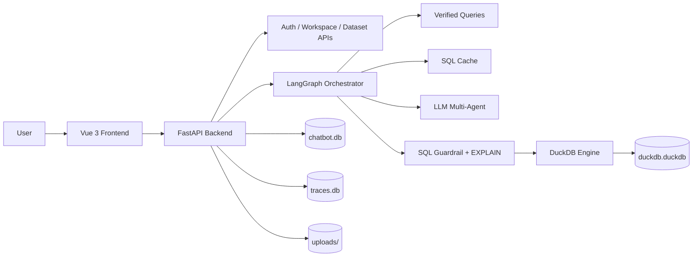

# 智能问数平台

企业级自然语言取数与分析平台，提供完整的前后端实现：用户认证、工作空间、多数据源与数据集管理、CSV 导入、DuckDB 执行、LangGraph 编排的 NL2SQL、流式查询、手工 SQL、执行追踪与 SQL 长期复用。

## 特性概览

- 用户体系与工作空间管理，支持注册、登录、工作空间切换与新建
- 数据源管理，支持 `MySQL`、`PostgreSQL`、`SQL Server`、`DuckDB`、`CSV`
- 数据集语义层配置，支持多数据源绑定、指标/维度/别名/业务规则定义
- CSV 上传后自动保存到本地，并尝试抽取行列信息与 Schema
- 查询页支持数据集选择、表选择、多轮短会话上下文、流式执行反馈
- 查询结果支持明细表格与统计图表展示
- 支持手工 SQL 执行，并自动校验表范围与 SQL 安全性
- 内置 `trace`、结构化证据、`audit_id`、`trace_id`
- 成功查询会自动写入长期 `sql_cache`，后续同类问题可直接复用
- 侧边栏内置 LLM 心跳探测，前端可见环境状态

## 当前查询链路

### 1. 数据准备

查询请求进入后，后端会先把数据集关联的 CSV 文件加载到 DuckDB，并为表名加上数据集作用域前缀：

```text
ds{dataset_id}_{table_name}
```

这样可以避免不同数据集出现同名表污染。

### 2. 查询规划

`backend/app/services/nl2sql.py` 中的主规划顺序为：

1. 识别意图：`chat` / `search` / `list` / `count`
2. 非结构化问答或内容检索直接分流
3. 在候选表范围内优先匹配 `verified_queries.json`
4. 若未命中，再尝试命中 `sql_cache`
5. 若仍未命中，再走 LLM 多 Agent 生成 SQL
6. Reviewer 不通过时执行自动修正
7. 若仍无法生成可靠 SQL，则返回 `reject`

### 3. 执行与回写

生成出的 SQL 在真正执行前会经过：

- `SQLGuardrail.validate_sql()` 只允许安全 `SELECT`
- DuckDB `EXPLAIN` 预检
- 参数清洗与表白名单检查

执行成功后会：

- 返回结构化结果、答案摘要、图表建议、执行历史
- 记录 `trace_id` / `audit_id`
- 持久化到 `traces.db`
- 自动写入 `sql_cache`，形成长期复用能力

### plan_source 说明

接口返回里的 `plan_source` 常见值如下：

| 值 | 含义 |
| --- | --- |
| `verified_query` | 命中人工维护的可信模板 |
| `sql_cache` | 命中历史成功 SQL 缓存 |
| `llm` | 由 LLM 规划生成 |
| `manual_sql` | 由用户提交手工 SQL 执行 |
| `reject` | 当前问题未通过规划或审查 |

## 系统架构



## 前端页面

### `/query`

主查询页面，支持：

- 选择工作空间、数据集、数据表
- 输入自然语言问题
- 流式显示执行阶段反馈
- 展示答案、结果表格、统计图
- 结合最近若干轮上下文理解追问

页面内置的快捷示例包括：

- `查询两个表中相同省份、相同账期的收入对比`
- `查询2025年12月各二级发展渠道的收入分布`
- `统计2025年11月各渠道类型的渠道数量`
- `查询最近10条渠道收入明细`

### `/config`

数据配置页，支持：

- 新建数据源
- 上传 CSV
- 创建与编辑数据集
- 给数据集绑定多个数据源
- 设置数据集状态

### `/history`

历史记录列表页，支持按数据集筛选查看 `QueryHistory`。

### `/settings`

系统设置页，支持查看用户信息与创建工作空间。

## 技术栈

### 后端

- FastAPI
- SQLAlchemy + SQLite
- DuckDB
- LangGraph
- Pydantic / pydantic-settings
- Requests

### 前端

- Vue 3
- TypeScript
- Vite
- Pinia
- Vue Router
- Element Plus
- ECharts

## 目录结构

```text
.
├── backend
│   ├── app
│   │   ├── api                 # 认证、数据源、数据集、查询、历史、系统监控接口
│   │   ├── core                # 配置、数据库、日志、安全
│   │   ├── models              # SQLAlchemy 模型
│   │   ├── services            # NL2SQL、trace、guardrail、verified query 等服务
│   │   ├── orchestrator_*.py   # DuckDB 与 LangGraph 编排
│   │   └── schemas             # Pydantic 请求/响应模型
│   ├── data                    # SQLite / DuckDB / Trace / 上传文件 / verified_queries
│   ├── logs                    # Trace 文件日志
│   ├── requirements.txt
│   ├── init_db.py
│   └── main.py
├── frontend
│   ├── src
│   │   ├── api                 # 前端 API 封装
│   │   ├── layouts             # 布局
│   │   ├── router              # 路由
│   │   ├── stores              # Pinia 状态
│   │   └── views               # 登录、查询、配置、历史、设置页面
│   ├── package.json
│   └── vite.config.ts
├── deploy                      # 容器化草稿
├── logs                        # start.sh / stop.sh 启动日志与 pid
├── start.sh
├── stop.sh
└── restart.sh
```

## 快速开始

### 环境要求

- Python `3.10+`
- Node.js `18+`
- `npm`

### 1. 初始化数据库

首次运行建议先初始化业务表：

```bash
cd backend
python init_db.py
```

这一步会创建 `users`、`workspaces`、`data_sources`、`datasets`、`query_histories` 等业务表。

### 2. 配置 LLM

后端通过 `backend/.env` 读取主要配置。建议新建 `backend/.env`：

```dotenv
SECRET_KEY=change-me-in-production
LLM_BASE_URL=https://your-openai-compatible-endpoint
LLM_API_KEY=your-api-key
LLM_MODEL=your-model-name

TRACE_DB_PATH=./data/traces.db
TRACE_FILE_LOG_ENABLED=true
TRACE_LOG_DIR=./logs/traces
```

说明：

- `LLM_*` 用于 NL2SQL 主链路与心跳检查
- `TRACE_*` 用于追踪与 SQL 缓存持久化
- 请不要把密钥直接写入仓库脚本或提交到 Git

### 3. 创建第一个用户

当前前端只有登录页，没有注册页。首次使用请调用后端注册接口：

```bash
curl -X POST http://localhost:50805/api/v1/auth/register \
  -H "Content-Type: application/json" \
  -d '{
    "username": "admin",
    "password": "change-me-123",
    "email": "admin@example.com",
    "full_name": "Admin"
  }'
```

注册成功后，系统会自动创建一个默认工作空间并建立用户关联。

### 4. 一键启动前后端

在仓库根目录执行：

```bash
./start.sh
```

脚本会：

- 检查 Python / Node / npm / pip
- 按需安装后端依赖
- 按需安装前端依赖
- 启动后端 `50805`
- 启动前端 `50803`

启动后可访问：

- 前端：http://localhost:50803
- 后端健康检查：http://localhost:50805/health
- Swagger 文档：http://localhost:50805/docs

### 5. 关闭或重启

```bash
./stop.sh
./restart.sh
```

## 手动启动

### 后端

```bash
cd backend
python -m pip install -r requirements.txt
python init_db.py
python -m uvicorn main:app --host 0.0.0.0 --port 50805 --reload
```

### 前端

```bash
cd frontend
npm install
npm run dev -- --host 0.0.0.0 --port 50803
```

## 使用流程

### 1. 登录

用注册好的账号登录前端。

### 2. 创建或导入数据

在“数据配置”页面可以：

- 新建数据库型数据源
- 上传 CSV 文件
- 刷新数据源 Schema
- 创建数据集并绑定多个数据源

### 3. 进入查询页

在“智能取数”页面：

- 选择工作空间
- 选择数据集
- 勾选要参与查询的数据表
- 输入自然语言问题

### 4. 查看结果

查询返回后可以看到：

- SQL
- SQL 参数
- 结果表格
- 图表建议与图表展示
- `trace_id`
- `audit_id`
- 执行阶段历史
- `plan_source`

### 5. 手工修正 SQL

如果需要，也可以通过后端 `execute-sql` 接口执行人工编辑后的 SQL。系统会做：

- SELECT 白名单限制
- 表白名单校验
- 参数清洗
- EXPLAIN 预检

## API 概览

### 认证与工作空间

- `POST /api/v1/auth/register`
- `POST /api/v1/auth/login`
- `GET /api/v1/auth/me`
- `GET /api/v1/auth/workspaces`
- `POST /api/v1/auth/workspaces`

### 数据源与数据集

- `POST /api/v1/data-sources`
- `POST /api/v1/data-sources/upload-csv`
- `POST /api/v1/data-sources/test`
- `GET /api/v1/data-sources/{id}/schema`
- `POST /api/v1/data-sources/{id}/refresh-schema`
- `POST /api/v1/datasets`
- `GET /api/v1/datasets`
- `PATCH /api/v1/datasets/{id}`
- `DELETE /api/v1/datasets/{id}`

### 查询

- `POST /api/v1/queries/stream`
- `POST /api/v1/queries`
- `POST /api/v1/queries/execute-sql`
- `GET /api/v1/queries/{trace_id}/replay`

### 历史与监控

- `POST /api/v1/history`
- `GET /api/v1/history`
- `GET /api/v1/history/{history_id}`
- `GET /api/v1/system/llm-heartbeat`
- `GET /health`

## 数据落盘说明

当前仓库里主要有四类本地数据：

| 路径 | 作用 |
| --- | --- |
| `backend/data/chatbot.db` | 业务元数据，存储用户、工作空间、数据源、数据集、历史等 |
| `backend/data/traces.db` | 查询 Trace 与 `sql_cache` |
| `backend/data/duckdb.duckdb` | DuckDB 执行引擎持久化文件 |
| `backend/data/uploads/` | 上传的 CSV 原始文件 |

另外还有两类日志目录：

- `logs/`：`start.sh` 生成的前后端启动日志与 PID
- `backend/logs/traces/`：Trace 文件日志

## Verified Query 与 SQL Cache

### Verified Query

`backend/data/verified_queries.json` 是人工维护的可信模板库。

用途：

- 对固定问法做稳定复用
- 规避 LLM 幻觉
- 提供可审计、可版本化的 SQL 模板沉淀

注意：

- 当前文件默认是空数组
- 它不会自动根据每次成功查询写入
- 需要人工维护或单独建设晋升流程

### SQL Cache

`sql_cache` 是当前已经生效的长期复用能力：

- 成功查询后自动写入
- 记录问题、SQL、参数、表作用域、命中次数
- 下次相同问题且表范围一致时优先复用
- 命中后仍会做安全校验与 EXPLAIN
- 若缓存 SQL 失效，会自动删除并回退到 LLM

## 常见问题

### 1. 页面显示“环境启动异常”

侧边栏状态来自 `/api/v1/system/llm-heartbeat`。优先检查：

- `LLM_BASE_URL`
- `LLM_API_KEY`
- `LLM_MODEL`
- LLM 服务是否支持 `/v1/models` 或 OpenAI 兼容 `chat/completions`

### 2. 查询时报“未找到可查询的数据表”

通常说明：

- 当前数据集没有关联 CSV 数据源
- 关联的 CSV 文件路径已经失效
- 查询时未选中任何可用表

### 3. CSV 被错误识别成单列

代码里已经做了多轮分隔符探测与容错重载，但仍建议保证：

- 文件头完整
- 编码尽量使用 UTF-8 / UTF-8-SIG
- 分隔符明确

### 4. 为什么 trace 已经有了，但 replay 仍然不可用？

因为 `trace/sql_cache` 是后端主链路自动持久化的，而 `query_histories` 目前依赖前端额外调用 `/history` 或业务方自行落库。直接调用查询接口但不补写历史时，`replay` 无法命中记录。

## 后续适合继续完善的方向

- 打通外部数据库直连查询，而不只依赖 CSV 落地到 DuckDB
- 给 `verified_queries` 增加后台维护界面与审核流
- 自动把合格查询沉淀为可审核模板，而不是只停留在 `sql_cache`
- 把 `query_histories` 写入下沉到后端主链路，避免依赖前端补写
- 整理并修正容器化部署配置

## License

当前仓库未声明开源许可证。如需公开分发，请补充明确的 `LICENSE` 文件。
